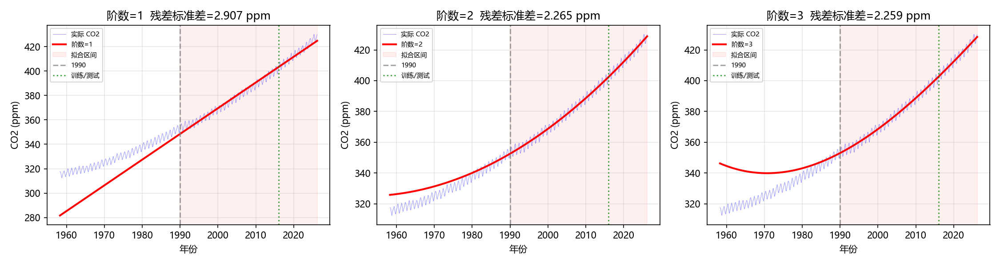
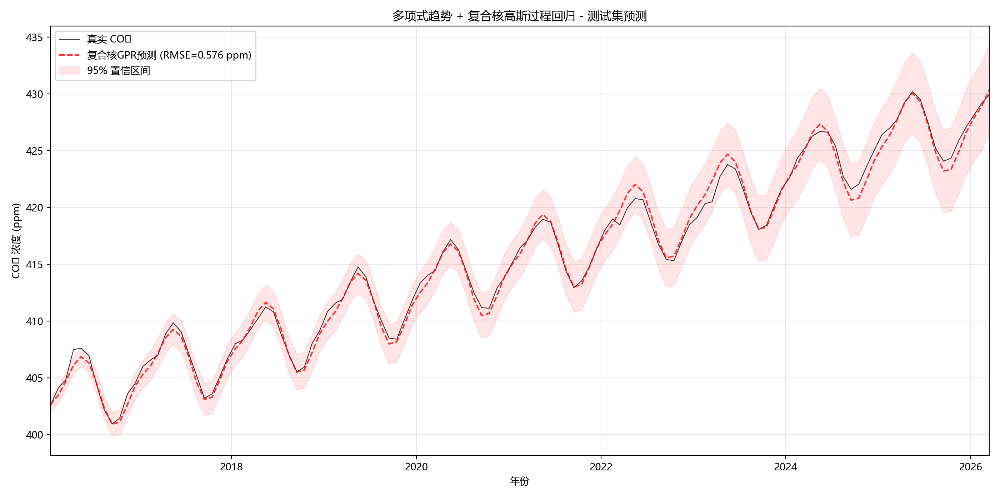

# 多项式趋势 + 复合核GPR 预测结果


## 方法流程

1. **数据划分**：训练集 1958.3~2016.0（693 点），测试集 2016.0~2026.2（123 点）
2. **趋势拟合**：用 **1990~2015 年间的训练数据**拟合三阶多项式（选取 1/2/3 阶中残差标准差最小的）
3. **去趋势**：用拟合好的多项式计算全部数据的趋势值，计算残差
4. **GPR 建模**：仅用训练集残差训练高斯过程回归模型，并在测试集残差上做预测
5. **还原**：将 GPR 预测残差加回趋势项，得到 CO₂ 预测值


## 趋势函数

**最佳阶数**：3 阶（三次多项式）

**残差标准差**：2.240 ppm

**趋势表达式**：
```
p(t) = 7.133337e+06 - 1.064969e+04·t + 5.299035·t² - 8.787157e-04·t³
```

## 核函数设计

采用三部分组合核函数：
- **长期趋势核**：`C × RBF(length_scale=10)` — 捕捉缓慢变化趋势
- **季节周期核**：`C × RBF × ExpSineSquared(period=1)` — 固定周期 1 年，幅度慢变
- **噪声核**：`WhiteKernel` — 捕获观测白噪声

## 结果对比

| 模型 | CO₂ RMSE (ppm) | CO₂ MAE (ppm) | CO₂ R² | MAPE | 95% CI 覆盖率 |
|------|----------------|---------------|--------|------|--------------|
| **RBF + 周期核** | **0.5765** | **0.4486** | **0.9944** | **0.11%** | **99.2%** |
| 仅 RBF（无周期） | 17.3823 | 16.8025 | -4.1273 | 4.03% | — |
## 可视化

## 结论

1. **RBF+周期核表现优异**：测试集 CO₂ RMSE 仅 0.58 ppm，R² 达 0.994，说明组合核函数能够很好地捕捉 CO₂ 数据的长期趋势和季节周期成分。
2. **去掉数据泄露后结果依然可靠**：趋势仅用训练集数据拟合，测试集是真实外推场景，MAPE 仅 0.11%，模型具有实际预测能力。
3. **周期成分至关重要**：纯 RBF 核模型 R² 为负，说明不含周期核的 GPR 完全不适合 CO₂ 这种强季节性数据。
4. **周期固定为 1 年**：基于 CO₂ 周期特征的先验知识，将 ExpSineSquared 周期固定为 1.0，优化效果更稳定。


